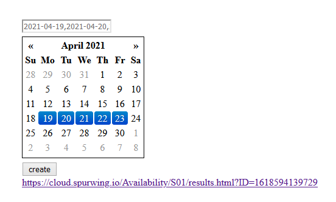
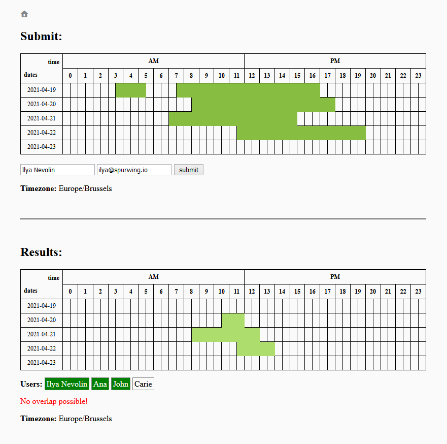

# Scheduling Tool for Teams Across Different Time Zones
This project is an implementation of a group scheduling tool and booking tool for teams.

This software is inspired by online tools like Doodle, which allow us to share a link where team members can indicate their availability. The results can be monitored in real-time and show all overlapping dates and times where all users can attend.

## Demo

Live demo: [https://cloud.spurwing.io/Availability/S01/](https://cloud.spurwing.io/Availability/S01/)

Use the homepage's calendar to select a few candidate dates. Upon submitting you will see an URL appear, share this link with the participants.

On the new link each user can select the cells to indicate their availability for a given date and time. A name and email address must be provided in order to submit the answer. Updating an already submitted answer is possible by re-submitting using the same email.

The results sections shows the strict overlap of all the answers, of each submitted user. But also allows you to toggle individual members to see the overlap or intersection.

Notice that all submissions and views are timezone relative. This means that we can easily schedule and book meetings with members from different timezones on the fly. Each user's timezone is taken into account and translated into a universal UTC timestamp. The final results page shows all submissions relative to the viewer's timezone.

**Coming soon:** schedule a meeting with Spurwing's API and send email invitations to all participants.

## Requirements
NodeJS v12+ with NPM

## Usage
1. run `npm install` (once)
2. run `npm start`
3. open `http://localhost:8000`

Hint: use `nodemon` to make the app restart automatically on changes.

## Support
- For public issues and bugs please use the GitHub Issues Page.
- For enquiries and private issues reach out to us at support@spurwing.io
- Join our Discord Community Server: https://discord.gg/j3gd5Qk5uW
